# Fixer une caméra sportive sur un casque de vélo

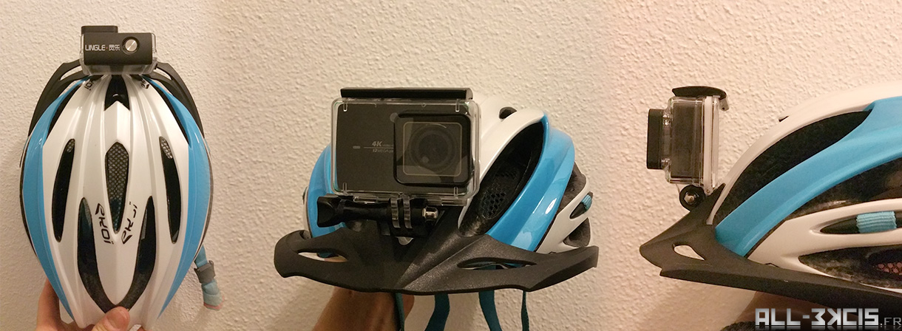
**Author** : All3kcis - **Source** : [All-3kcis.fr - Fixer une caméra sportive sur un casque de vélo](http://all-3kcis.fr)  
**Github** : [Contribute](https://github.com/all3kcis/memento-docs/tree/master/how-to-fix-a-sport-camera-to-bike-helmet)

## Présentation*
Comment fixer (discrètement et solidement) une camera type Gopro sur un casque de vélo (casque aéré non plat, impossible d'utiliser les supports collés au double face)  

Le support sera positionné sur l'avant du casque et non sur le dessus pour être plus discret.

**Durée** : environ 2-3h  
**Niveau de difficulté** : facile  

> **En bonus** une version ultra simple, durée 2 minutes, voir fin du tutoriel  :smirk: 

## Les outils

- Cutter
- Feutre
- Colle Epoxy
- Dremel ou équivalent

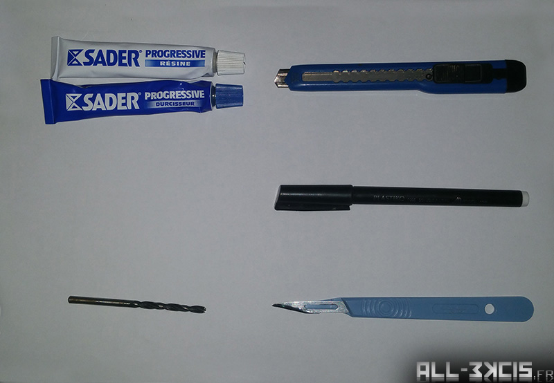
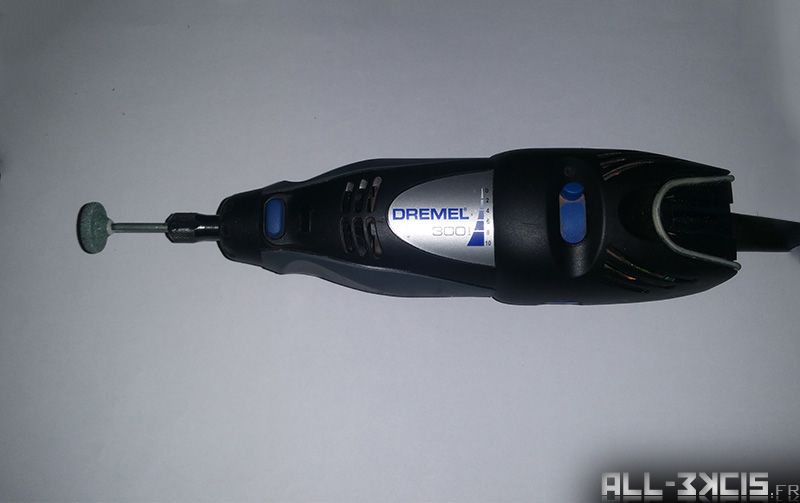

## Le matériel
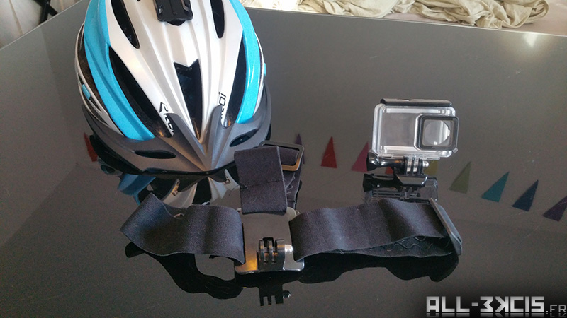

- Un casque
- Une fixation de camera sportive
- Support de camera pour tester (réglage des mouvements)

## Introduction
Prenez bien le temps de voir comment ajuster au mieux le support sur votre  casque, surtout si le modèle diffère du mien.  
Vous pourrez ainsi adapter au fur et à mesure du tutoriel si besoin.

## Première étape : Analyse
Détacher la casquette et positionner le support de caméra à l'endroit voulu.

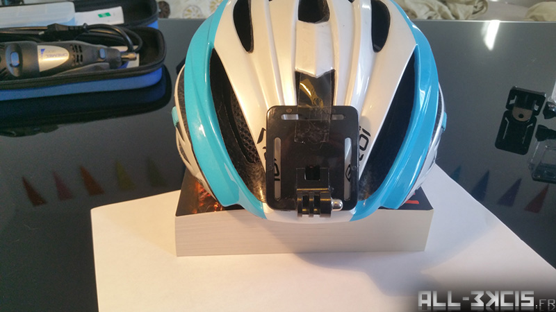

> Regarder comment l'integrer au mieux à votre casque.

## Deuxième étape : Préparation du support

Découpe du support pour une taille plus réduite. (Attention à garder une taille minimum pour que la colle est assez de prise)  
J'ai réalisé ma découpe en fonction des formes du casque pour que l'intégration du support se voit le moins possible.  
Scotchez temporairement le support sur le casque à l'endroit voulu, repérez les découpes à effectuer.  
  
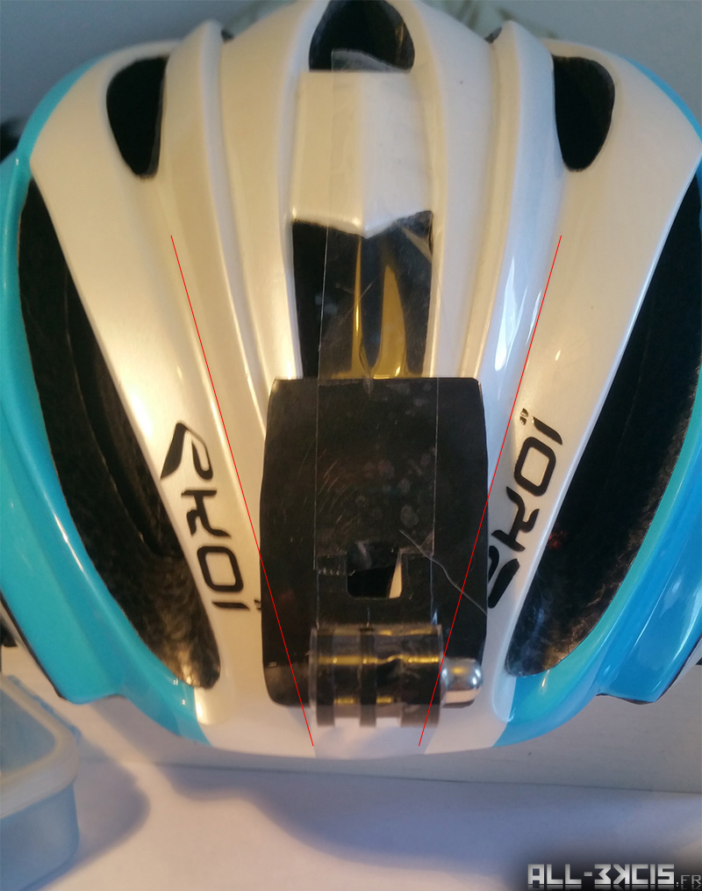

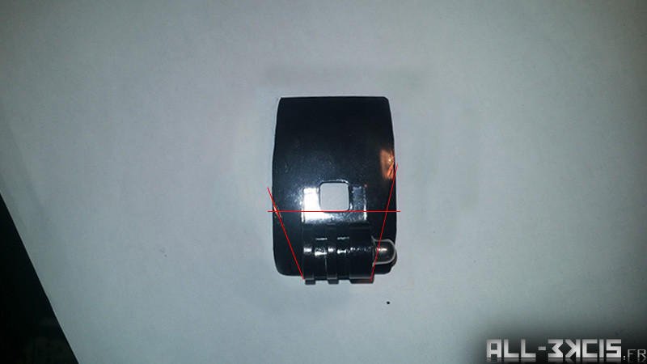  
Effectuez les découpes, pour ma part je n'avais plus de disque à découpe sur la dremel j'y suis donc allez à la pince coupante ça marche bien aussi  :smile:  
  
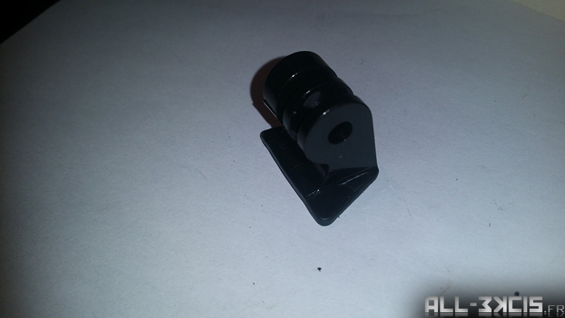  
Un coup de ponçage pour enlever les irrégularités et voila le support est prêt.  

> **Pensez à poncer le dessous du support** pour que la colle puisse bien prendre

## Troisième étape : Découpe du casque
Repositionnez le support sur le casque et tracé les découpes, le plus droit possible ! (mieux que moi de préférence)  :laughing:

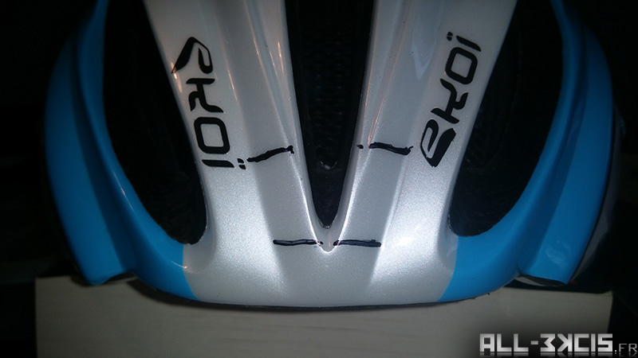  
Dans un premier temps, couper le plastique dur au cutter, ensuite il se décolle très facilement.

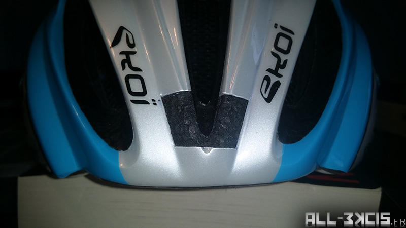  
Puis découpez le polystyrène pour avoir une surface plane. (C'est ici que j'ai utilisé le scalpel pour être plus précis).  
J'ai creusé de 2 à 4mm de profondeur. (au minimum l'épaisseur du support)   

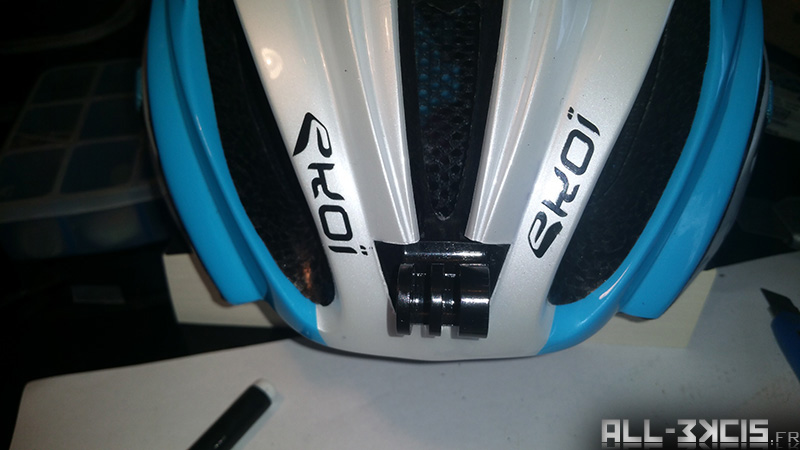  
Placez le support pour vérifier qu'il rentre convenablement.   

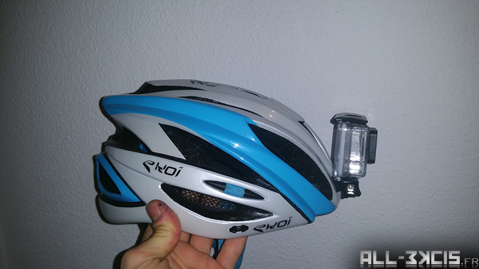  
Pensez à bien vérifier que la camera peut être réglée librement sans bloquer ni sur le casque ni sur le support.  

## Quatrième étape : (Optionnelle mais offre une meilleure solidité)

Pour être sûr que le support soit bien fixé j'ai voulu rajouter des vis...
J'ai donc pris deux vis dont j'ai taillé les têtes au format rectangulaire du support pour pouvoir les encastrer.  

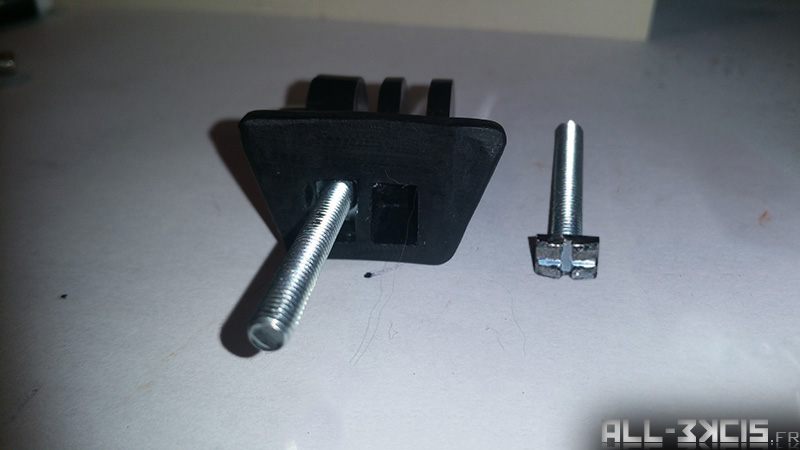  
Faites les trous correspondant dans le casque (pas besoin de perceuse, juste le foret et quelques tours de main suffisent)  

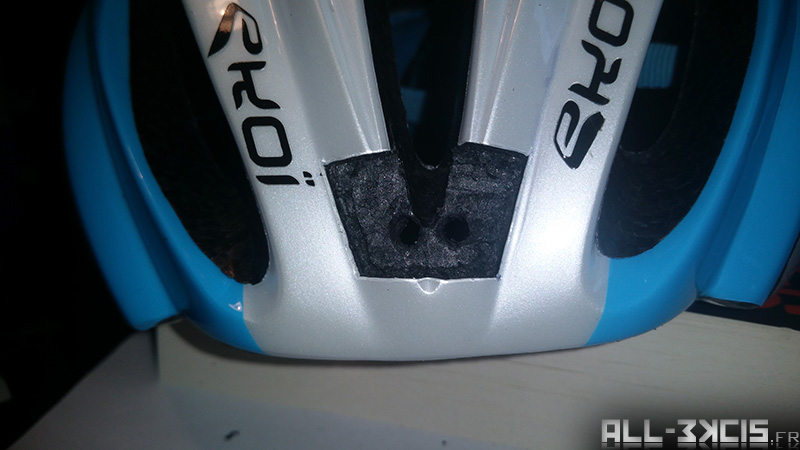  
Ensuite étape importante !  
Mettre en place le support avec les vis, repérer la taille que doivent faire les vis.  
Prenez l'épaisseur du casque dont vous retirez quelques millimètres.  
**Ceci pour une question de sécurité**, si vous chutez sur l'avant du casque le polystyrène va faire son job et se contrater,  
il faut donc prévoir une marge pour les vis si vous voulez pas les retrouver dans votre front ;)

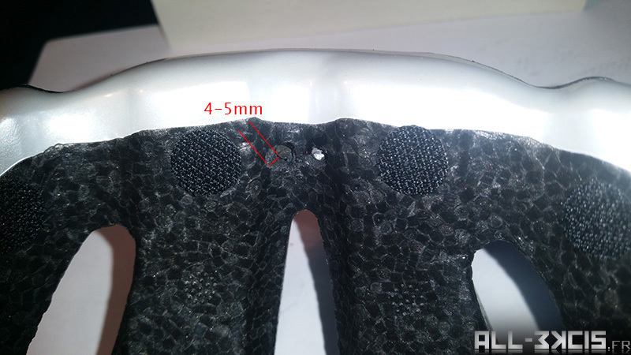

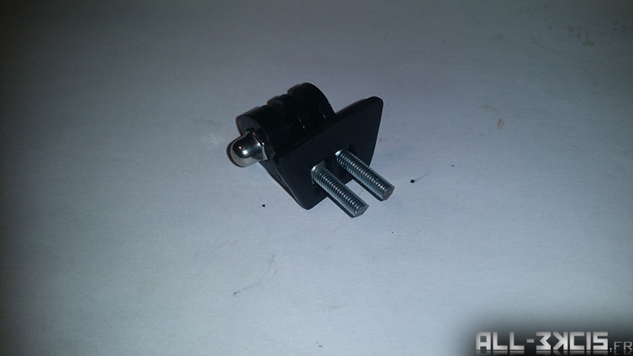  
Le support est prêt avec ses deux vis de fixation.  

## Cinquième étape : Découpe de la visière

Rien de compliqué ici, positionnez la visière sur le casque **sans le support**, repérez les découpes à faire en vous plaçant face au casque. 

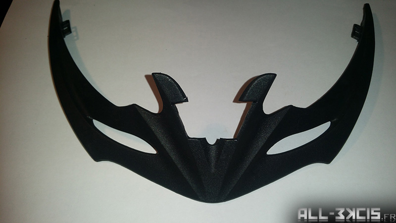  

## Sixième étape : Test final avant collage

On monte tout, support + caméra et visière, on vérifie le montage/ démontage de la camera et de la visière.

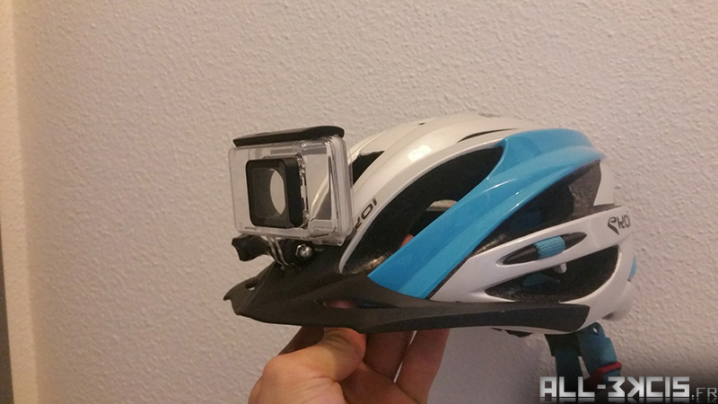

## Septième étape : Collage !

Préparation du mélange Epoxy  

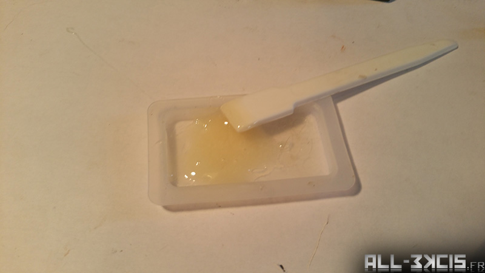  

Commencez par remplir les trous du support si vous avez choisi de rajouter les vis  

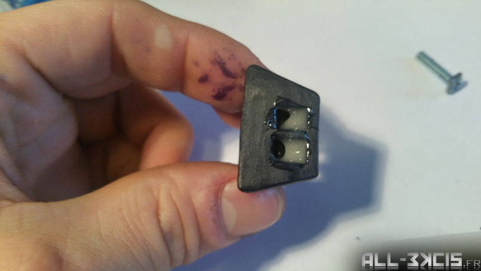  

Rajoutez les vis et soyez généreux sur la dose de colle, ne pas oublier le pas de vis.  

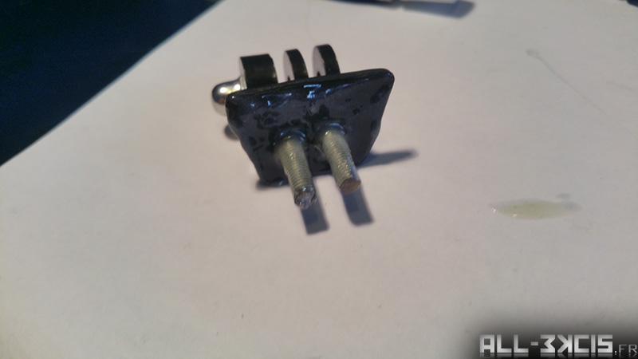  

Mettre un petit bout de scotch côté intérieure du casque pour éviter que la colle ne s'écoule des trous pendant le séchage.  

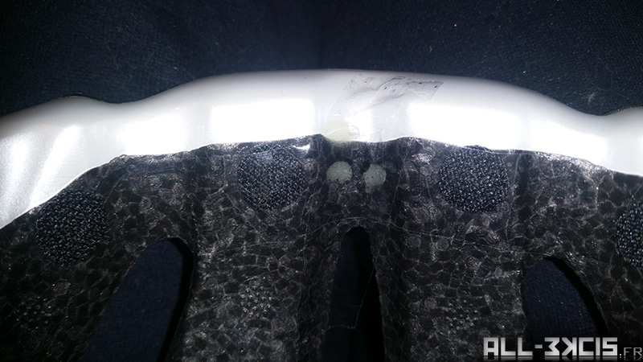  

Encollage du casque, veillez à bien mettre suffisament de colle dans les trous des vis.  

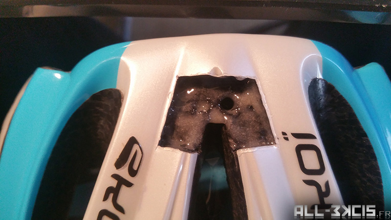  

On assemble les deux parties et on laisse au moins 24h de séchage !  

## Résultat final :

  
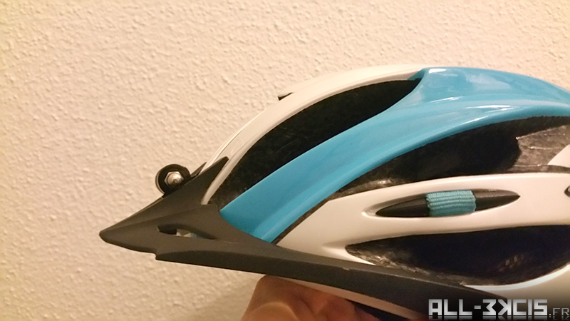  

## Bonus :

Avec ce support il y a juste à le loger dans l'éaeration central du casque.
ça tient plus ou moins mais ça peut dépanner !

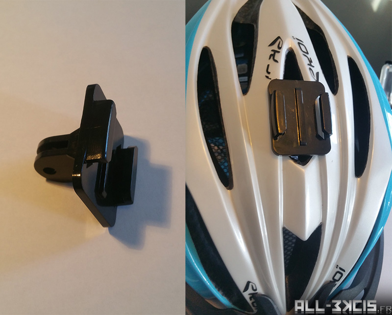
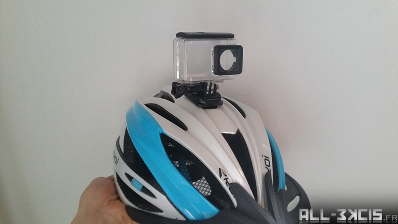