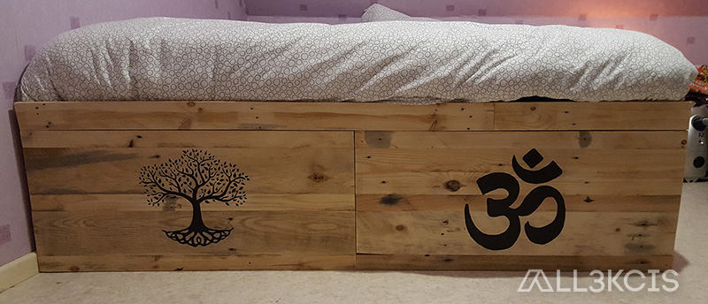
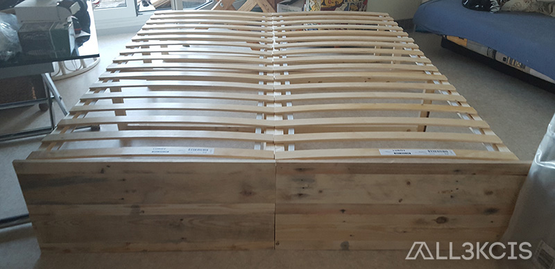
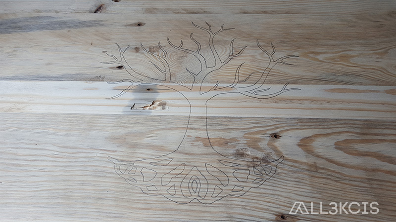
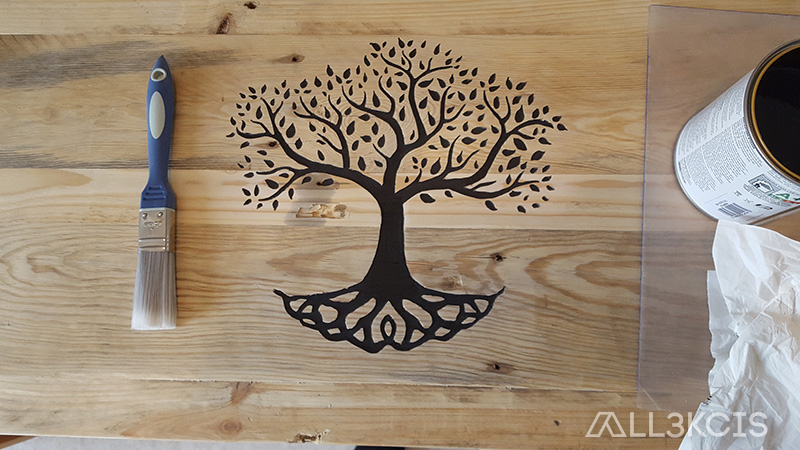

# Lit en bois de palettes

  
**Auteur** : All3kcis - **Source** : [blog.alexis-mesnard.fr - Lit en bois de palettes](https://blog.alexis-mesnard.fr/pallets-bed/)  
**Date** : 2018 - **Github** : [Contribute](https://github.com/all3kcis/tutorials/tree/master/pallets-bed)

## Présentation
Structure en tasseaux de pin raboté placage bois de palette et gravure  
Taille : 160x200 cm

## Le matériel

- [Tasseaux pin 32x50mm](https://www.leroymerlin.fr/v3/p/produits/lot-de-6-tasseaux-sapin-petits-noeuds-brut-32-x-50-mm-l-2-4-m-e62068)
- [Sommier à lattes Ikea - Luröy - 80x200cm](https://www.ikea.com/fr/fr/catalog/products/50160208/?cid=fr%7cps%7cgo%7cPLA_CSS_Chambre_Matelas_G_S_X_X_P_PLA-Chambre_Matelas_G_S_X_X_P_PLA-50160208&gclid=EAIaIQobChMIwN2ArM7w4QIVRp3VCh3q1A8aEAQYAyABEgLFs_D_BwE&gclsrc=aw.ds#/30160209)
- Vernis incolore
  
## Ressources

- [Maquette 3D (Sketchup)](ressources/maquette-3D-lit.skp)
- [Arbre EPS (Illustrator)](ressources/arbre.eps)
- [Om Indien EPS (Illustrator)](ressources/om.eps)

## Photos  

  
  
  
  
  
  
  
  
  
  
  
  