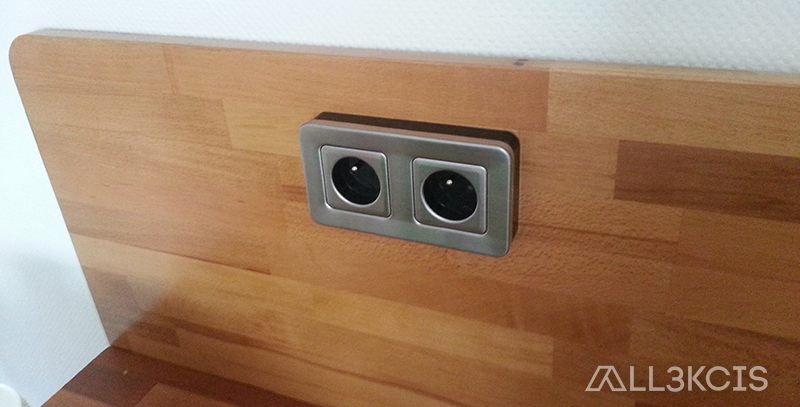
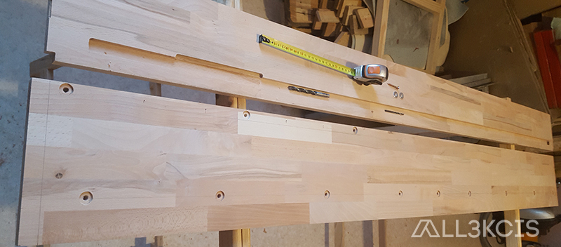
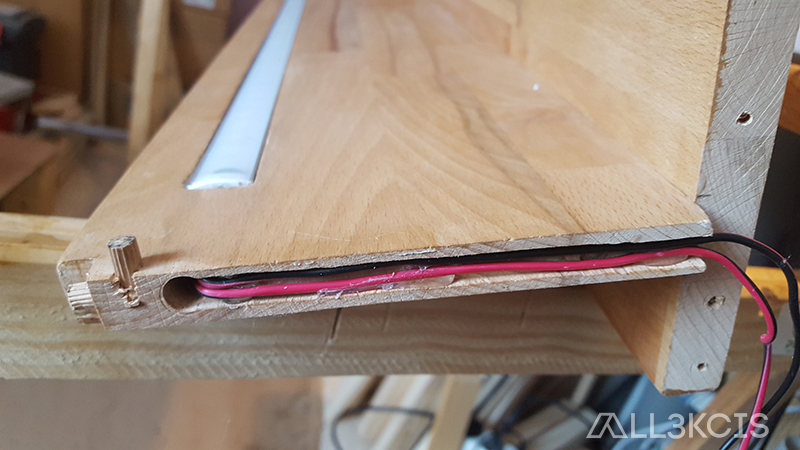

# Meuble de cuisine en palettes et hêtre

  
**Auteur** : All3kcis - **Source** : [blog.alexis-mesnard.fr - Meuble de cuisine en palettes et hêtre](https://blog.alexis-mesnard.fr/pallets-kitchen-furniture-01/)  
**Date** : 2017 - **Github** : [Contribute](https://github.com/all3kcis/tutorials/tree/master/pallets-kitchen-furniture-01)

## Présentation
Un meuble qui a de la gueule ! Trois modules de 60cm de large fixés entre eux.  
Un module avec niche éclairée et deux grands tiroirs.    
Un module central pour four encastrable + niche de rangement pour les accessoires du four    
Un module de quatre tiroirs  

Structure en tasseaux de pin rabotés, Plaquage planches de palettes, plan de travail et étagère en hêtre.  
Bloc led incrusté dans l'étagère pour éclairer le plan de travail et bandeau de led dans la	niche branchés sur un détecteur  

**Durée** : Long :)  
**Prix** : ~ 450-500€  

## Le matériel
> Liste non exhaustive  
> Il n'y a aucun partenariat sur les liens, ils sont purement indicatifs 

- Des palettes HT = Hors traitement = Traitement thermique (entre 6 et 10 à la louche...)
- [Tasseaux pin 32x50mm x3 - 47€](https://www.leroymerlin.fr/v3/p/produits/lot-de-6-tasseaux-sapin-petits-noeuds-brut-32-x-50-mm-l-2-4-m-e62068)
- [Plan de travail bois Hêtre 250x65x3.6cm 95€](https://www.leroymerlin.fr/v3/p/produits/plan-de-travail-bois-hetre-brut-mat-l-250-x-p-65-cm-ep-26-mm-e133729)
- [Tube carré en acier 20x20mmx2.5m x6 - 66€](https://www.bricodepot.fr/colmar/tube-carre-en-acier-paf-l-250m-l-20mm-h-20mm-ep-125mm/prod1798/ref170894/)
- [Tube carré en acier 10x10mmx1m x2 - 7€](https://www.leroymerlin.fr/v3/p/produits/tube-carre-acier-brut-noir-l-1-m-x-l-1-cm-x-h-1-cm-e1501608031)
- [Coulisses - 37€ (réduction coûts mais pas idéal)](https://www.leroymerlin.fr/v3/p/produits/coulisse-pour-tiroir-a-galets-hettich-15-kg-l-55-cm-e22697)
- [Tablette Hetre 200x50x1.8 - 37€](https://www.leroymerlin.fr/v3/p/produits/tablette-hetre-lamelle-colle-l-200-x-l-50-cm-x-ep-18-mm-e1501915089)
- [Tablette Hetre 200x40x1.8 - 30€](https://www.leroymerlin.fr/v3/p/produits/tablette-hetre-lamelle-colle-l-200-x-l-40-cm-x-ep-18-mm-e1501913546)
- [Roulettes x12 - 28€](https://www.leroymerlin.fr/v3/p/produits/roulette-pivotante-a-platine-diam-35-mm-e1401442847)
- [Bandeau LED cornière alu - 15€](https://fr.aliexpress.com/item/32367475101.html)
- [Bloc prises - 18€](https://www.leroymerlin.fr/v3/p/produits/double-prise-avec-terre-city-metal-lexman-e1401455992)
- Huile de lin - 10€
- Contreplaqué 5mm - 15€
- Colle à bois - Colle Epoxy
- Peinture / vernis
- Outils divers - Défonceuse - Scie sur table - Scie à onglets - Ponceuse - Poste à souder etc
  
## Ressources
  
  - [Maquette 3D meuble](ressources/plan-meuble-palettes.skp)
  - [Modèle coupe poignés rond - Sketchup](ressources/modele-poigne-rond.skp)
  - [Modèle coupe poignés rond - STL](ressources/modele-poigne-rond.stl)
  - [Modèle coupe poignés long - Sketchup](ressources/modele-poigne.skp)
  - [Modèle coupe poignés long - STL](ressources/modele-poigne-rond.stl)
  - [Calle bloc prise - Sketchup](ressources/calle-prise-elec.skp)
  - [Calle bloc prise - STL](ressources/calle-prise-elec.stl)

## Photos  

  
  
  
  
  
  
  
  
  
  
  
  
  
  
  
  
  
  