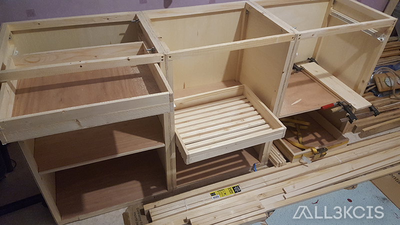
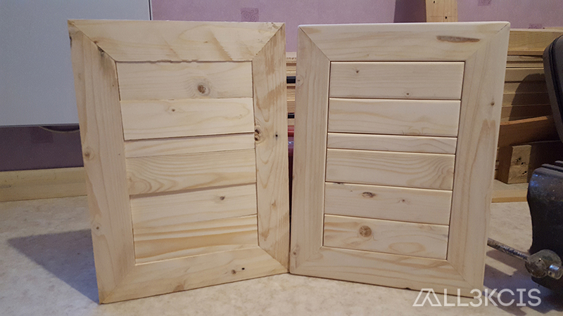
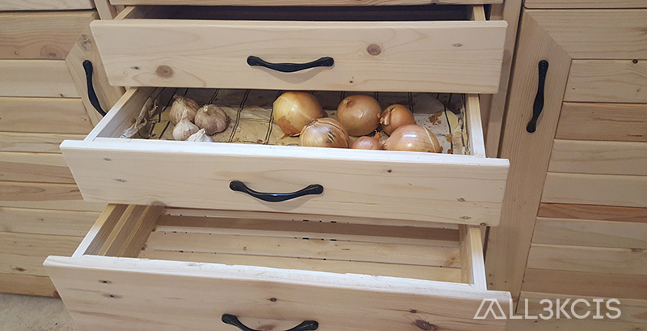

# Meuble de rangement cuisine en palettes et hêtre

  
**Auteur** : All3kcis - **Source** : [blog.alexis-mesnard.fr - Meuble de rangement cuisine en palettes et hêtre](https://blog.alexis-mesnard.fr/pallets-kitchen-furniture-02)  
**Date** : 2017 - **Github** : [Contribute](https://github.com/all3kcis/tutorials/tree/master/pallets-kitchen-furniture-02)

## Présentation
Meuble de rangement, structure en tasseaux de pin, placage bois de palettes, plan de travail en hêtre.  
Trois modules de 60cm de larges fixés entre eux.  
Deux modules placard surmontés d'un tiroir   
Un module central avec deux petits placards pour ranger les moules à gâteaux et plats, trois tiroirs à fruits et légumes et un tiroir de rangement divers     

**Durée** : Long :)  
**Prix** : ~ 250€  

## Le matériel
> Liste non exhaustive  
> Il n'y a aucun partenariat sur les liens, ils sont purement indicatifs 

- Des palettes HT = Hors traitement = Traitement thermique (entre 6 et 10 à la louche...)
- Tasseaux pin plusieurs tailles - ~ 40€
- [Coulisses 400mm - 25€](https://www.leroymerlin.fr/v3/p/produits/coulisse-pour-tiroir-a-galets-hettich-20-kg-l-40-cm-e22693)
- [Tablette Hetre 200x60x1.8 - 48€](https://www.leroymerlin.fr/v3/p/produits/tablette-hetre-lamelle-colle-l-250-x-l-60-cm-x-ep-18-mm-e1401690591)
- [Roulettes x12 - 28€](https://www.leroymerlin.fr/v3/p/produits/roulette-pivotante-a-platine-diam-35-mm-e1401442847)
- [Poignées 121mm x10 - 30€](https://fr.aliexpress.com/item/32522218766.html)
- Contreplaqué 5mm - 40€
- Colle à bois
- Vernis
- Outils divers - Scie sur table - Scie à onglets - Ponceuse  etc
  
## Ressources
  
  - [Maquette 3D meuble](ressources/modele-3d-meuble2.skp)

## Photos  

  
  
  
  
  
  
  
  