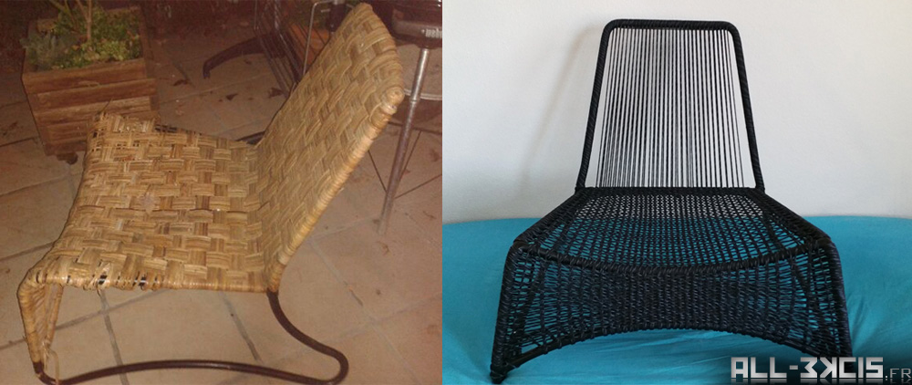

# Recycling an Ikea (Masö) armchair (rattan to paracord)

**Author** : All3kcis - **Source** : [All-3kcis.fr - Recycling an Ikea (Masö) armchair (rattan to paracord)](https://tutorials.all-3kcis.fr/recycling-ikea-armchair-rattan-to-paracord/)  
**Github** : [Contribute](https://github.com/all3kcis/tutorials/tree/master/recycling-ikea-armchair-rattan-to-paracord)

## Description
Idea to recycle an Ikea (Masö) armchair.  
The aim is to remove the original rattan and replace it with paracord or equivalent. 

**TODO**  
You can help me to translate it :) Thanks for your contributions.