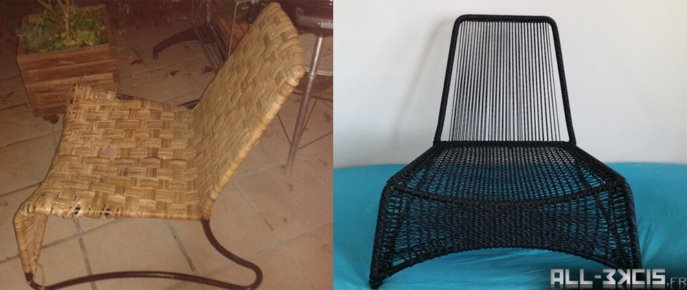
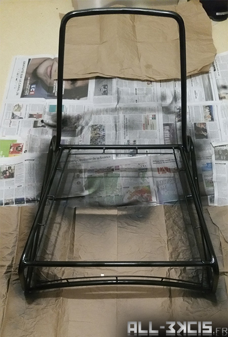
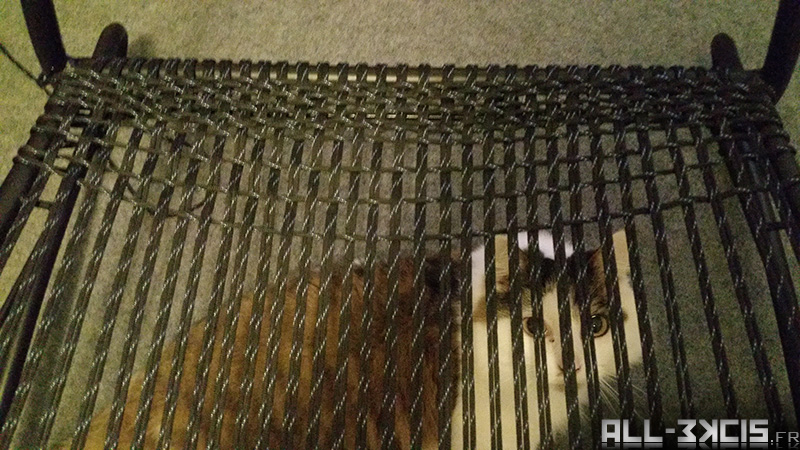

# Recycler un fauteuil Ikea modèle Masö (rotin vers paracorde)

**Autheur** : All3kcis - **Source** : [All-3kcis.fr - Recycler un fauteuil Ikea modèle Masö (rotin vers paracorde)](https://tutorials.all-3kcis.fr/recycling-ikea-armchair-rattan-to-paracord/)  
**Github** : [Contribute](https://github.com/all3kcis/tutorials/tree/master/recycling-ikea-armchair-rattan-to-paracord)

## Présentation
Idée de recyclage d'un fauteuil modèle Masö de chez Ikea
Le but étant de retirer le rotin d'origine et le remplacer par de la paracorde ou équivalent.

**Durée** : 24-48h (+ temps de séchage)  
**Prix** : ~ 30€  
**Niveau de difficulté** : facile mais long

## Le matériel

- Cutter
- Papier de verre
- Peinture en bombe
- Paracorde ~ 7x 30 mètres

**Astuces**
> La paracorde originale peut revenir chère, n'étant pas utilisée pour un élément de sécurité vous pouvez utiliser de la paracorde chinoise sans problème. Celle-ci n'est peut être pas authentique mais reste très solide et largement suffisante dans ce cas.  
> Lien ebay : www.ebay.fr/itm/20-50-75-100-300FT-7-Noyau-Paracord-Corde-Parachute-Corde-550-20-Couleur-Choix-/131909681174  
> La couleur que j'ai utilisé est "238 black + blue"  
> Pour ce qui est de la peinture vous trouverez des bombes de peinture chez Action pour environ 3€ unité : http://www.action.fr/spectrum-peinture-a-rosol-acr-400ml-noir-m-tallique  
> Existe aussi en mat et autres couleurs.

## Première étape : Retirer le rotin d'origine

Retirer tout le rotin, utiliser un cutter en particulier pour les morceaux qui restes collés.  
  
Poncer au papier de verre les restes de colle et les éclats de soudure (ils risqueraient d'endommager la paracorde pendant le tressage)  
  
Prenez un peu de temps pour définir les motifs voulu.
  

## Deuxième étape : Peinture
Passer une fine couche de peinture sur toute la surface, insister un peu plus sur les zones poncées.  
 

## Troisième étape : Tressage

> Pendant le tressage faites attention à ce que la corde de se vrille pas

Début du tressage !  
Utilisation de 30 mètres de paracorde pour la demi-assise dans le sens haut/bas.
Les brins sont groupés par deux dans ce sens.  
  

Détails de la transition assise / avant  

Puis la deuxième moitié avec la même technique.  
  
  
Puis on commence le tressage perpendiculaire (j'étais bien surveillé)   
Une fois dessus, une fois dessous, rien de sorcier mais il faut s'armer de patience.  
  
  
Vue détaillée, ça avance bien !  
  
  
Le tressage de l'assise est terminé. Il restera les finitions côté gauche et droit.  
  
  
Tressage de la partie avant, malheureusement j'ai du oublié de prendre des photos ...    
Voila une fois fini, c'est vraiment pas la partie la plus simple.  
  
  
Ensuite on attaque le dossier. J'ai choisi de ne pas le tresser horizontalement, je trouve ça plutôt joli et plus confortable.   
**Notez la technique du rilsan pour servir de buter et garder le tout en place**  
  
  
Puis pareil côté droit  
  
  
Terminer le dossier en entourant le pourtoure.  
Il est possible de cacher la corde qui traverse entre le côté droit et gauche en la passant avant de faire le dossier.  
  
  
Terminer l'assise en entourant les côtés gauche et droit comme pour le dossier.  
  
  
Admirer le résultat !  
  
  
  
  
 

  
