# Trek GR738 Aiguebelle Vizille 2020

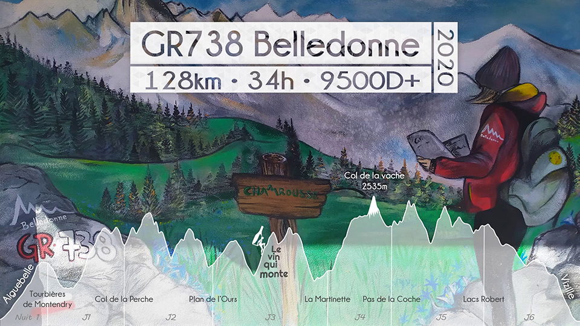
**Auteur** : All3kcis - **Source** : [blog.alexis-mesnard.fr - Trek GR738 Aiguebelle Vizille 2020](https://blog.alexis-mesnard.fr/trek-gr738-aiguebelle-vizille-2020-fr)  
**Github** : [Contribute](https://github.com/all3kcis/tutorials/tree/master/trek-gr738-aiguebelle-vizille-2020) - **Vidéo** : [Youtube](https://www.youtube.com/watch?v=MGEU7Kq-EqM)

## Présentation
Trek en autonomie de Aiguebelle à Vizille sur le GR 738 en Août 2020.  
1 Nuit au refuge de la Martinette (je recommande !) - 5 jours d'autonomie alimentaire  
Trek plus compliqué que le TMB, le terrain est beaucoup moins roulant, plus cassant. Pour info il est comparé au GR20.  

**Durée** : 6 jours (7 étapes) - 34h de marche  
**KM** : 128km  
**D+** : 9500m  

## Le matériel

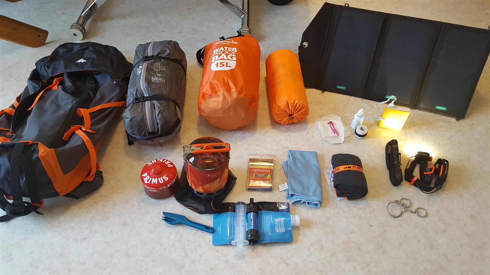

 - [Sac MH500 40L](https://www.decathlon.fr/sac-a-dos-mh500-40l-noirorange-id_8382980.html)
 - [Tente Quickhiker Ultralight 3](https://www.decathlon.fr/tente-quickhiker-ultralight-3-id_8245651.html)
 - [Water bag 15L](https://fr.aliexpress.com/store/product/Naturehike-Waterproof-Dry-Bag-Roll-Top-Dry-Compression-Sack-for-Kayaking-Beach-Rafting-Boating-Hiking-Camping/3721007_32857958803.html) (pour ranger le duvet et des vêtements)
 - [Matelas SEATOSUMMIT Ultralight](https://www.decathlon.fr/ultralight-si-id_8382713.html)
 - [AUKEY Chargeur Panneau Solaire 20W](https://www.amazon.fr/gp/product/B019XAVMPY/)
 - [Popotte](https://fr.aliexpress.com/item/FMS-X2-New-Fire-Maple-compact-One-Piece-Camping-Stove-Heat-Exchanger-Pot-camping-equipment-set/32633881760.html) Equivalent JetBoil
 - Couverture de survie
 - Serviette microfibre
 - Lampe de poche + frontale
 - Pansements
 - Powerbank
 - [Filtre à eau Sawyer](https://www.amazon.fr/Sawyer-MINI-Filtre-eau-filtration/dp/B00FA2RLX2/)
 - Paracorde
 - Couteau

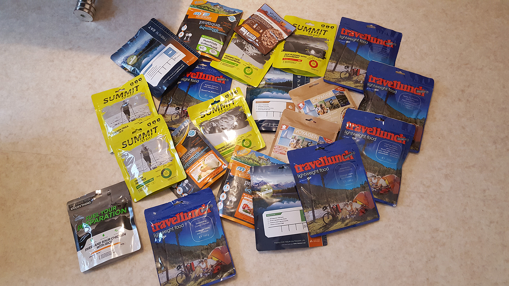  
 5 jours d'autonomie en lyophilisé  

## Préparation

[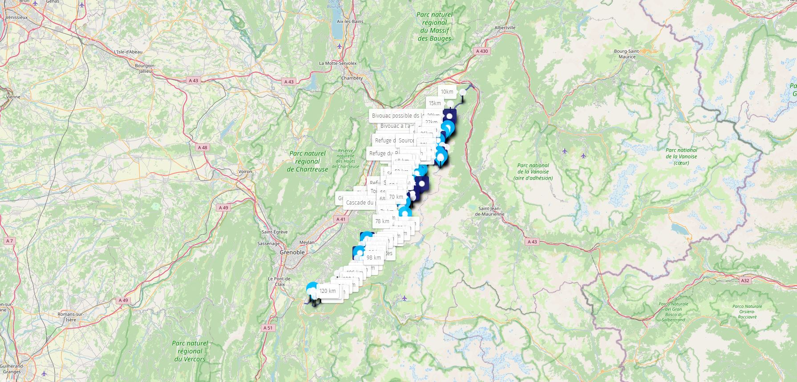](https://umap.openstreetmap.fr/fr/map/trek-gr738_481838)  
[Voir la carte en détail](https://umap.openstreetmap.fr/fr/map/trek-gr738_481838)  
[GPX GR738](ressources/GR738-Vizille-Aiguebelle.gpx)  
__Il est possible que le tracé GPX ne soit exactement le même que le balisage sur le terrain, privilégié donc le balisage dans ce cas__

## Etapes en résumé

### Etape 1: (Nocturne) Aiguebelle -> Tourbières de Montendry
11km 1100D+
### Etape 2: Tourbières de Montendry -> Col de la Perche
17km 1320 D+  
### Etape 3: Col de la Perche -> Plan de l'Ours
19km 1550 D+
### Etape 4: Plan de l'Ours -> La Martinettte
27km 1820 D+
### Etape 5: La Martinettte -> Pas de la Coche
15km 1640 D+
### Etape 6: Pas de la Coche -> lacs Robert
19km 1750 D+
### Etape 7: Lacs Robert -> Vizille
21km 250D+ 1850D-

## Photos

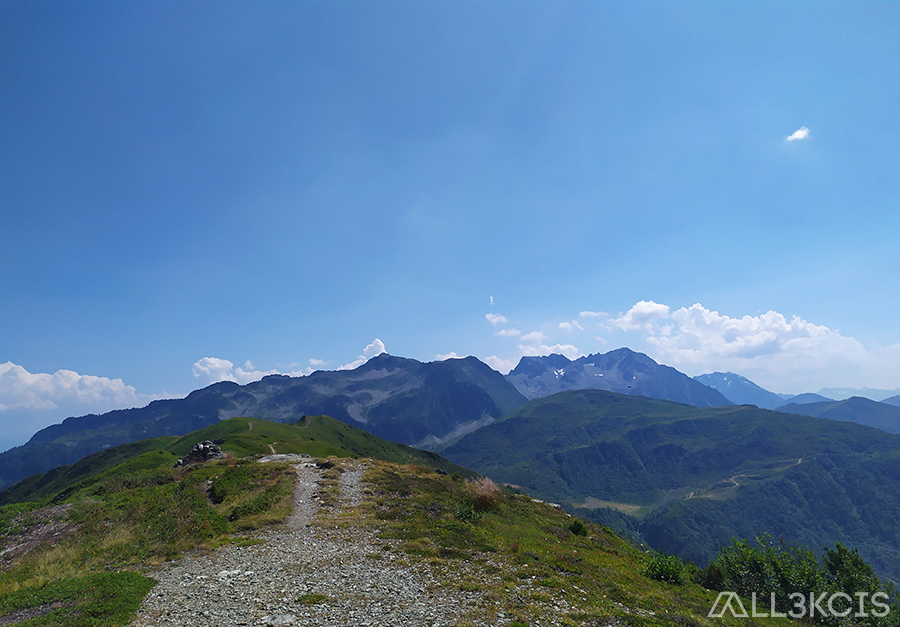  
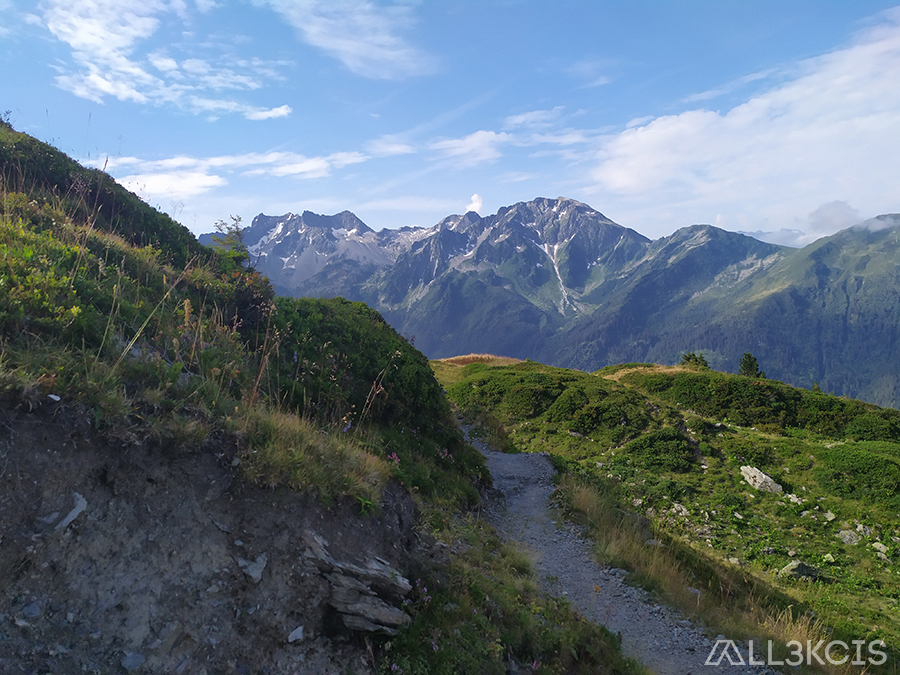  
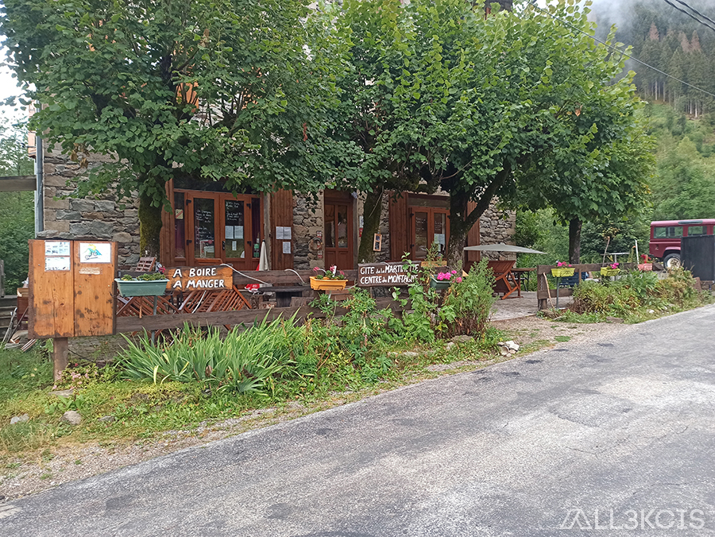  
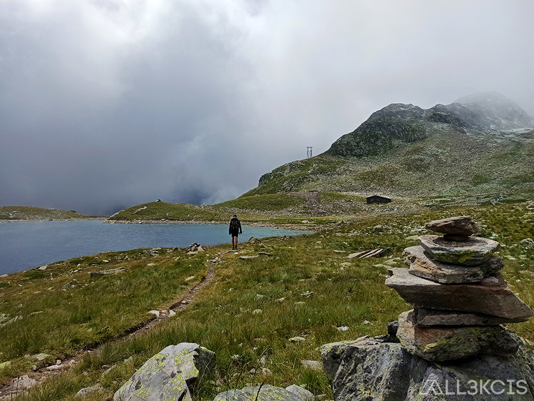  
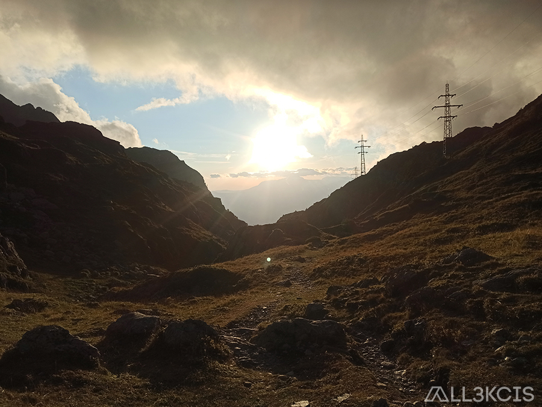  
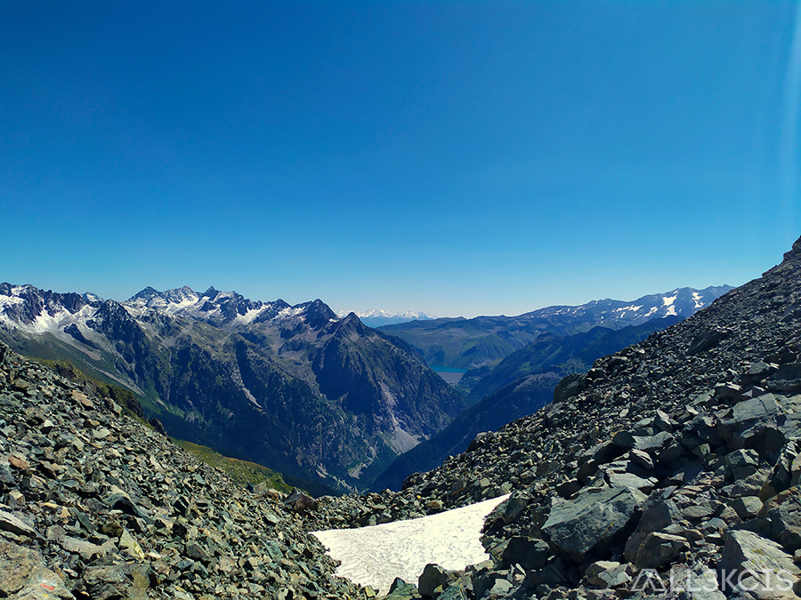  
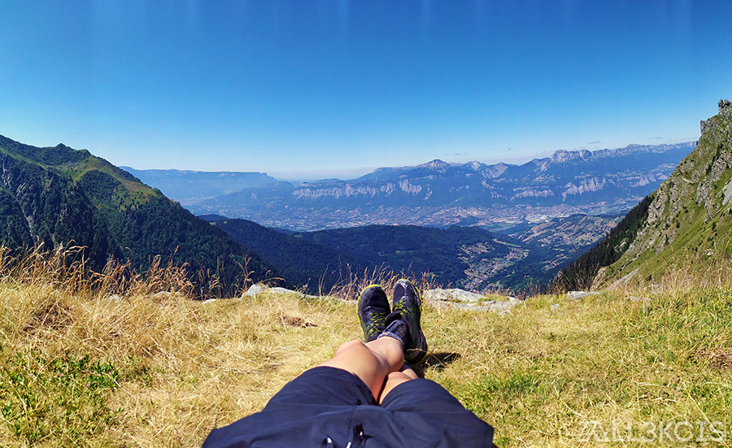  