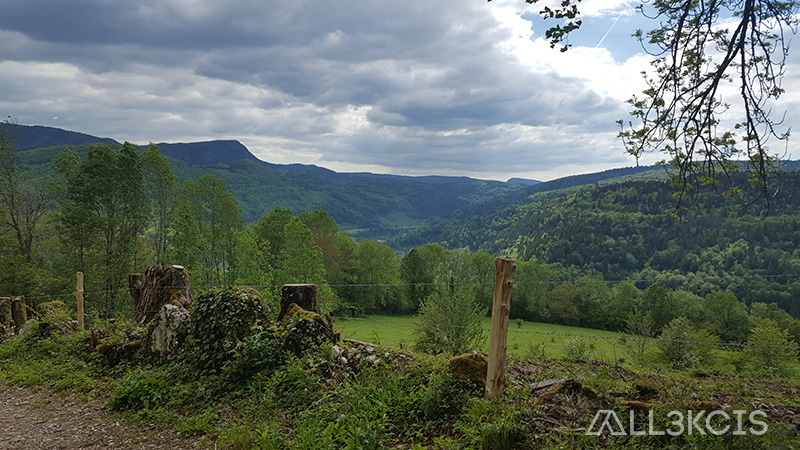
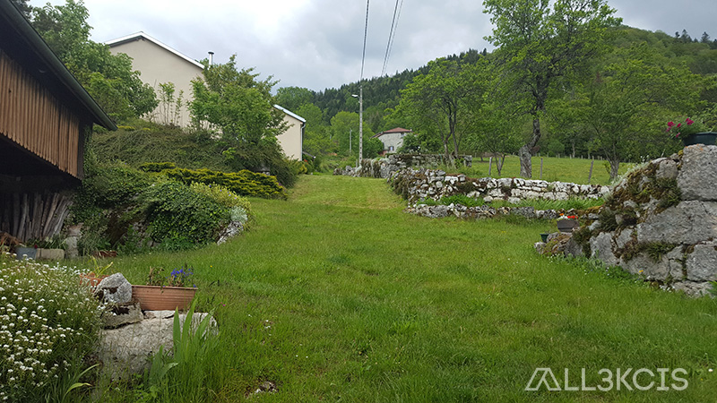
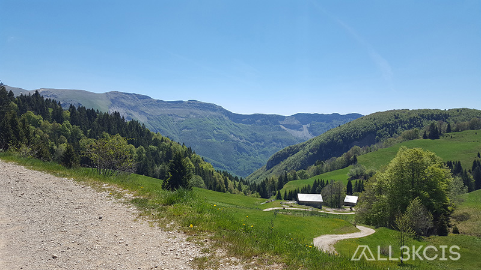
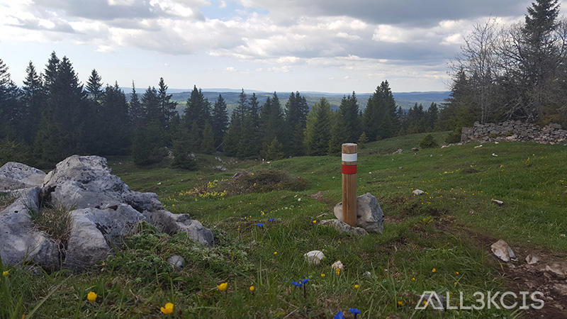
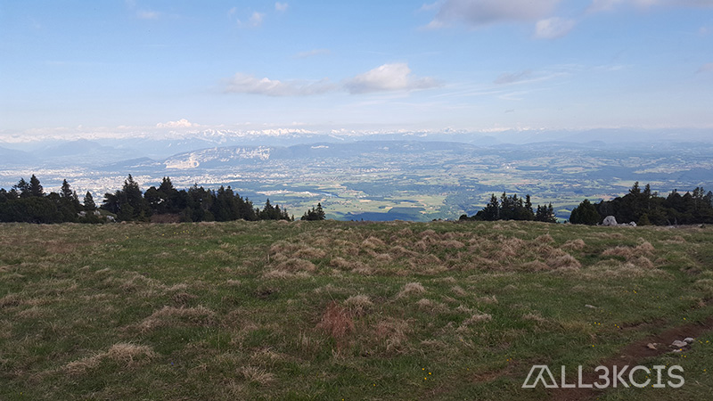
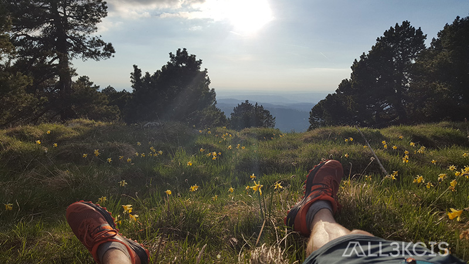
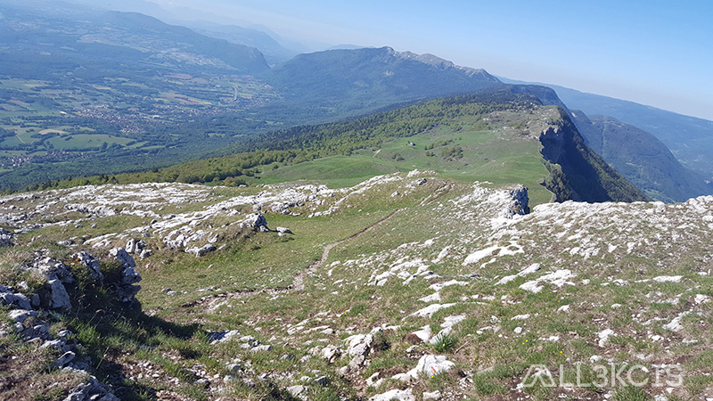

# Trek Jura - Bellegarde-sur-valserine - 2019

  
**Auteur** : All3kcis - **Source** : [blog.alexis-mesnard.fr - Trek Jura - Bellegarde-sur-valserine - 2019](https://blog.alexis-mesnard.fr/trek-jura-bellegarde-sur-valserine-fr)  
**Github** : [Contribute](https://github.com/all3kcis/tutorials/tree/master/trek-jura-bellegarde-sur-valserine)

## Présentation
Juin 2019, Trek en autonomie sur 3 jours   

**Durée** : 3 jours - 23h de marche  ( grosses étapes )  
**KM** : 95km  
**D+** : 3 670m  

## Le matériel

 - [Sac MH500 40L](https://www.decathlon.fr/sac-a-dos-mh500-40l-noirorange-id_8382980.html)
 - [Tente Quickhiker Ultralight 3](https://www.decathlon.fr/tente-quickhiker-ultralight-3-id_8245651.html)
 - [Water bag 15L](https://fr.aliexpress.com/store/product/Naturehike-Waterproof-Dry-Bag-Roll-Top-Dry-Compression-Sack-for-Kayaking-Beach-Rafting-Boating-Hiking-Camping/3721007_32857958803.html) (pour ranger le duvet et des vêtements)
 - [Matelas SEATOSUMMIT Ultralight](https://www.decathlon.fr/ultralight-si-id_8382713.html)
 - [AUKEY Chargeur Panneau Solaire 20W](https://www.amazon.fr/gp/product/B019XAVMPY/)
 - [Popotte](https://fr.aliexpress.com/item/FMS-X2-New-Fire-Maple-compact-One-Piece-Camping-Stove-Heat-Exchanger-Pot-camping-equipment-set/32633881760.html) Equivalent JetBoil
 - Couverture de survie
 - Serviette microfibre
 - Lampe de poche + frontale
 - Pansements
 - Powerbank
 - [Filtre à eau Sawyer](https://www.amazon.fr/Sawyer-MINI-Filtre-eau-filtration/dp/B00FA2RLX2/)
 - Scie à cable
 - Couteau (pas sur la photo)

## Préparation

  
[Voir la carte en détail](http://umap.openstreetmap.fr/fr/map/jura_300469)  
[GPX](ressources/jura-tour-valserine.gpx)  

## Vidéo

## Photos

  
  
  
  
  
  
  
  
  
  
  
  
  
  
  
  
  
  
  