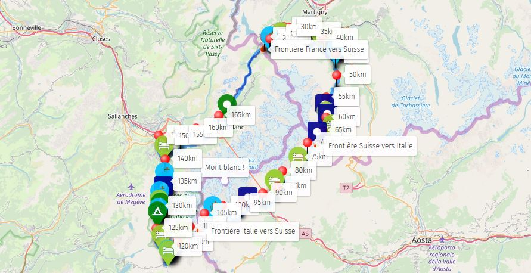

# Trek UTMB/TMB 2018

**Autheur** : All3kcis - **Source** : [blog.alexis-mesnard.fr - Trek UTMB/TMB 2018](https://blog.alexis-mesnard.fr/trek-tmb-utmb-2018/)  
**Github** : [Contribute](https://github.com/all3kcis/tutorials/tree/master/trek-tmb-utmb-2018)

## Présentation
Aout 2018, Trek en quasi autonomie à deux autour du Mont Blanc.  

**Durée** : 7 jours - 44h de marche  
**KM** : 175km  
**D+** : 10 600m  

## Le matériel

 - [Sac MH500 40L](https://www.decathlon.fr/sac-a-dos-mh500-40l-noirorange-id_8382980.html)
 - [Tente Quickhiker Ultralight 3](https://www.decathlon.fr/tente-quickhiker-ultralight-3-id_8245651.html)
 - [Water bag 15L](https://fr.aliexpress.com/store/product/Naturehike-Waterproof-Dry-Bag-Roll-Top-Dry-Compression-Sack-for-Kayaking-Beach-Rafting-Boating-Hiking-Camping/3721007_32857958803.html) (pour ranger le duvet et des vêtements)
 - [Matela SEATOSUMMIT Ultralight](https://www.decathlon.fr/ultralight-si-id_8382713.html)
 - [AUKEY Chargeur Panneau Solaire 20W](https://www.amazon.fr/gp/product/B019XAVMPY/)
 - [Popotte](https://fr.aliexpress.com/item/FMS-X2-New-Fire-Maple-compact-One-Piece-Camping-Stove-Heat-Exchanger-Pot-camping-equipment-set/32633881760.html) Equivalent JetBoil
 - Couverture de survie
 - Serviette microfibre
 - Lampe de poche + frontale
 - Pansements
 - Powerbank
 - [Filtre à eau Sawyer](https://www.amazon.fr/Sawyer-MINI-Filtre-eau-filtration/dp/B00FA2RLX2/)
 - Scie à cable
 - Couteau (pas sur la photo)

  
 5 jours d'autonomie en iophilisé  

## Préparation

  
[Voir la carte en détail](http://umap.openstreetmap.fr/fr/map/trek-utmb-2018_236000)  
[GPX UTMB](ressources/UTMB-2018.gpx)  

## Vidéo

## Récit

### Etape 1: On est frais ! - Chamonix -> Vallorcine
Départ de Chamonix à 1060m d’altitude.  
On est frais, beaucoup de D+ pour commencer mais gros rythme, nous sommes confiants et nous déroulons, un peu trop car on se trompe de chemin.. ce qui nous rajoutera surement dans les 200D+...  
  
Peu avant 12h, on tombe sur un couple de randonneurs portugais, dont la femme s’est tordu la cheville. Rien de grave, les secours sont prévenus, nous les attendons avec le couple de français les ayant appelé. Ce sera baptême d’hélicoptère pour elle et des belles images de l’hélicoptère qui se pose devant nous à deux reprises !  
  
On continue, le ciel se couvre .. Pause repas sous la pluie dès le premier jour ! Déjà 1300D+ ! On repart sous la pluie et le brouillard, peu de visibilité par moments, on est prudent et on navigue aux instruments autant qu'à la vue… On entame la descente sous la pluie, au fur et à mesure le ciel se découvre, ça fait plaisir ! Arrivés au niveau d’une route, on s'arrête dans le premier gîte, pour le moral, petite pause chocolat chaud après cet épisode pluvieux !  
  
On reprend la route direction la Suisse sans savoir où l’on va bivouaquer… Ce sera finalement à environ 2km de la frontière Suisse, on est déjà bien fatigué et on trouve un petit endroit dégagé dans la forêt avec un emplacement plus ou moins plat juste de la taille de la tente, ça évitera les interdictions de bivouac en Suisse et il y a un joli point de vue !  
  
### Etape 2: Direction Champex-lac pour bivouac en Suisse - Vallorcine -> Issert (CH)
  
9h, départ direction Champex-lac, ça va monter doucement une grosse partie de la journée, on remonte une piste de ski puis s’en suit une longue descente. (D-: 650m sur 2.5km)
Passage par Trent (CH) et on remonte direction le “Col de la Forclaz” où l’on fera la pause midi. D’abord attirés par la terrasse du restaurant du col, puis vite refroidis par les prix… 40 francs suisses le menu basique, on va rester sur le lyophilisé ça allègera le sac !  
  
Arrivés à Champex-lac après six heures de marche, c’est la ville ! Risqué de bivouaquer dans cette zone alors que c’est interdit ! Ayant prévu de pousser jusqu’à Praz de fort alors on avance ! Finalement on s'arrêtera un peu avant à mi-chemin entre Champex-lac et Issert. Bivouac en forêt à côté d’une table de pique-nique et d’un point d’eau, plutôt bien installé ! La longue descente et le sac à dos ont bien pesé sur les épaules pour moi, lever le bras est douloureux et difficile ! :D On fait les premières lessives, on détend les pieds dans l’eau fraîche de la fontaine.
  
### Etape 3: Passage du Grand Col Ferret (frontière Suisse-Italie) - Issert (CH) -> Arnuva
Aujourd’hui je me sens faible quasi aucune énergie, pas l’envie d’avancer.. Mais il n’y a pas le choix alors on y va ! (Il s'avèrera que je ne m’étais surement pas assez alimenté la veille au soir, je retiendrais la leçon)  
  
Pause midi dans une supérette, au menu, tomates cerises, blanc de dinde fumé de la région, pain, fromage, un fruit pour la route et une glace pour le petit plaisir.
Ce repas m'a bien requinqué et j’attaque la suite avec plus d’entrain.  
  
Passage au “Grand Col Ferret” (Alt 2490m), petite vidéo du panorama puis on entame la descente. Arrivés au refuge Elena, notre objectif du jour. A 38€ la place en dortoir avec douche sans eau chaude, non merci autant faire du bivouac… Bon déjà 25 km de parcouru en 6h mais on a encore un peu d’énergie alors on va pousser jusqu’à Arnuva ! On repart avec une question en tête, mais pourquoi cette appellation différente “Chalet Hotel” ?  
Arrivé là bas : “Bonjour, avez-vous deux places pour ce soir ?” _ “Oui c’est 170€ la chambre double avec douche”. _”Ah.. déception, bon bin merci quand même.” Glup ! Ah oui, un chalet hotel, d’accord !
On l’enviait cette douche chaude ! Bon bin on va dormir sous les arbres le long du torrent. Malgré l’interdiction Italienne de bivouaquer sous 2500m d’altitude nous ne serons pas les seuls à bivouaquer ici.  

### Etape 4: Privilégiés : Motivation pizza & douche chaude ! - Arnuva -> Courmayeur (Refuge grand Randonneur) (Italie)
Départ pour une étape qui s’annonce sans grosse difficulté, roulant le matin mais faut pas chômer si on veut faire le déjeuner en centre ville de Courmayeur. Arrivés à Courmayeur vers 13h il nous restera la montée vers le “Refuge de la vieille” à faire tranquillement après manger (3km et 700D+). Premier restaurant, pizzeria, que c’était bon !!
  
Grosse chaleur et D+ = fatigue plus rapide :) le stock d’eau diminue et on ne voit toujours pas le refuge, par contre on voit bien la piscine surplombant les pistes de ski sur les hauteurs de Courmayeur ! On arrive quelques minutes après au refuge du Grand randonneur, on décide de s'arrêter prendre un verre, nos réserves d’eau sont quasi à sec puis il faut bien profiter.  
Méfiant de notre aventure de la veille nous demandons si il reste de la place dans ce refuge tout en expliquant que l’on voulait pousser jusqu’au refuge suivant, malheureusement les dortoirs sont pleins, la gérante nous propose d’appeler le “refuge de la vieille”, pas de chance il est plein aussi !  

Privilégiés ? :
Elle nous dégotera finalement deux lits dans le chalet qui leur sert de pizzeria l’hiver, ~25m² rien que pour nous avec terrasse privative, pendant que les autres sont en dortoir, elle est pas belle la vie :D On profite de la soirée pour planifier l'itinéraire des prochains jours, on table finalement sur une durée de 7 jours et demi au total pour une arrivée samedi midi à Chamonix.

### Etape 5: ça sent le début de la fin - Gite du grand randonneur (Italie) - Les chapieux (FR)
  
A la recherche du Mont Blanco ! Mr se cache toujours dans son nuage…  
  
On commence la journée par trois heures de marche tranquillement jusqu’au refuge Elisabetta, puis on attaque le “Col des pyramides calcaires” à 2600m, l’arrivée au col se fera par la traversée d’un névé assez glissant, pas très rassurant… Ensuite on redescend à 2300m puis on remonte à 2500m pour passer le “Col de la seigne” qui est la frontière Italie/Suisse.  
  
Descente jusqu’au Chapieux !  
Près d’une retenue d’eau je vois trois trous les uns au dessus des autres, je m'arrête, je fais demi tour, c’est marrant ça, qu’est ce qui peut bien faire des terriers à étages comme ça ? On va faire une photo !
Quelle ne fut pas notre surprise quand deux petites marmottes sont sorties du terrier pendant que nous faisions la photo ! Elles n’étaient pas farouches ! Promenade pour l’une, grignotage de racine pour la deuxième :) La belle surprise de la journée.  
  
Arrivés aux Chapieux, six heures et demi de marche, on prends le temps de boire un coup, de faire quelques courses dans une micro épicerie, saucissons aux myrtilles, fromage, pain, puis on se dirige vers l’air de bivouac. Le ciel devenant menaçant on ne perd pas de temps on se trouve une petite place et on monte la tente en quelques minutes, on est rodé maintenant ! On abrite les affaires avant que l’orage n’arrive puis on se dirige vers la fontaine à 100m de là pour se laver les jambes pleines de terre. Ce qui devait arriver, arriva... Pas le temps de retirer les chaussures, ça commence à tomber.. Il tombe des cordes ! Retour à la tente en sprint, arrivés trempés forcément, on se sèche avec une seule serviette (efficace les microfibres !), Thomas ayant oublié la sienne la veille au refuge ;). Puis on savoure notre saucisson, pain et fromage du terroir achetés de justesse avant les précipitations, ah les petits bonheurs !  
  
### Etape 6: Encore un petit effort - Les Chapieux - St Gervais
Pas de pluie pendant la nuit ni au réveil, parfait. Aujourd’hui on commence la journée par une grosse dose de grimpette, au programme 1000m D+ d’entrée de jeu, même pas de faux plat pour s’échauffer ! Direction le refuge du col de la croix du bonhomme pour une heure et demie de marche.  
Arrivés la haut on se ressource un peu, on profite du soleil et de la température assez fraîche. En repartant Thomas reconnaît Zack Miller (Top 10 UTMB 2017), en reconnaissance en vue de l’UTMB fin août ! Le mec a potentiellement 10km et 1200m D+ dans les pattes et il paraît tout frais !  
  
Ce soir ce sera camping “Les Dômes de Miage” 4 étoiles. ENFIN ! Une vraie douche, avec du vrai savon !! Avec de l’eau chaude et qui dure plus de trois minutes !
  
Réveil après une bonne nuit et surtout une bonne douche, c’est agréable ! Le réveil n’a apparemment pas été aussi agréable pour nos voisins espagnols, tente coupée sur 40cm, l’argent liquide disparu… Dix minutes plus tard nous nous rendrons compte que les voisins anglais on subit le même sort…
  
### Etape 7: Dernière ligne (presque) droite - St Gervais - Chamonix
  
Bonne nuit au camping, on part décontracté sur une allure pépère, yeahh dernier jour !
Aie ! c’est dur quand même, moi dans ma tête le plus gros était fait ! Faut encore grimper ce matin ! 900mD+ pour le “Col de Voza” à 1640m. Rythme tranquille pour arriver au ”Camping des champs” à 15h, un camping “à l’ancienne” ici pas de 4 étoiles mais ce sera notre campement pour deux nuits. On hésite même à lancer un enregistrement Strava quand on doit aller aux communs. 20mD+ c’est pas mal juste pour aller aux toilettes :D  
  
On monte la tente et on reprend la route vers Chamonix avec une idée en tête, trouver un maillot de bain pour pouvoir aller à la piscine !
Et c‘est comme ça que se terminera notre périple, arrivés à 16h30 à Chamonix notre point de départ ou nous retrouverons les voitures ainsi que la piscine !