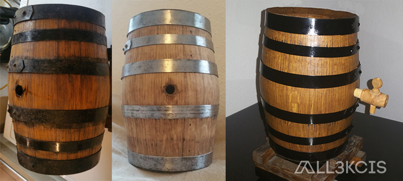
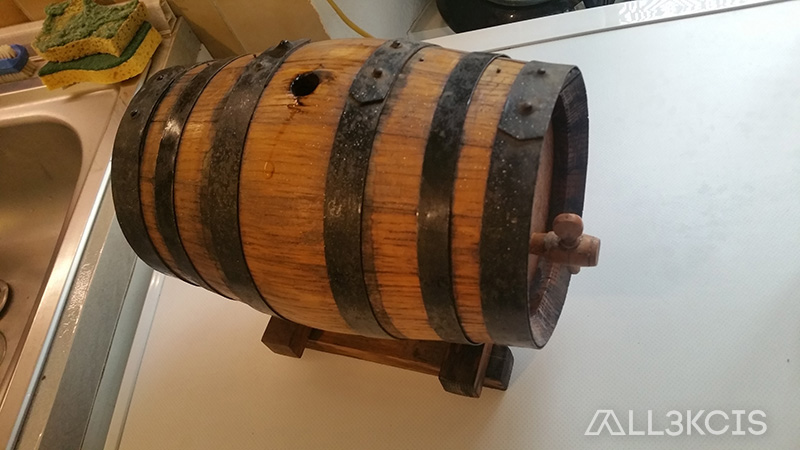

# Restauration d'un vinaigrier en fût de chêne

  
**Auteur** : All3kcis - **Source** : [blog.alexis-mesnard.fr - Restauration d'un vinaigrier en fût de chêne](https://blog.alexis-mesnard.fr/vinegar-maker-barrel)  
**Date** : 2017 - **Github** : [Contribute](https://github.com/all3kcis/tutorials/tree/master/vinegar-maker-barrel)

## Présentation
Restauration d'un vinaigrier en fût de chêne  

## Le matériel

- Tonnelet / fût
- [Bouchon liège](https://www.ebay.fr/itm/BOUCHON-LIEGE-A-BOCAUX-AVEC-DESSOUS-EN-CROUTE-D-ECORCE-70-MM/400309122108)
  
## Photos  

  
  
  
  
  
  