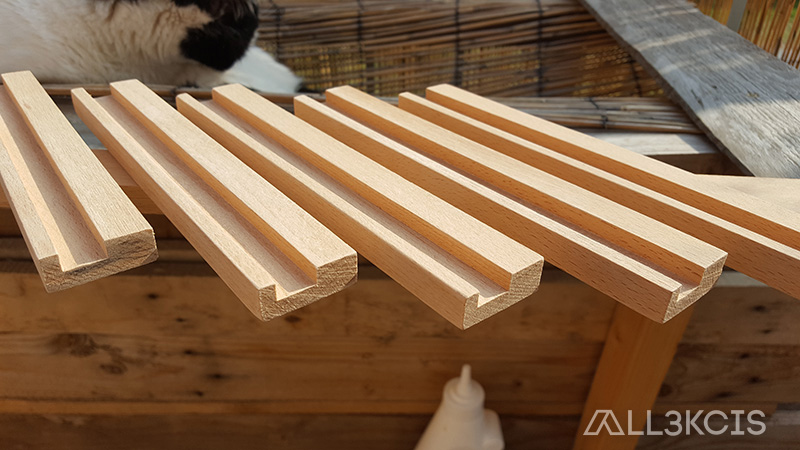
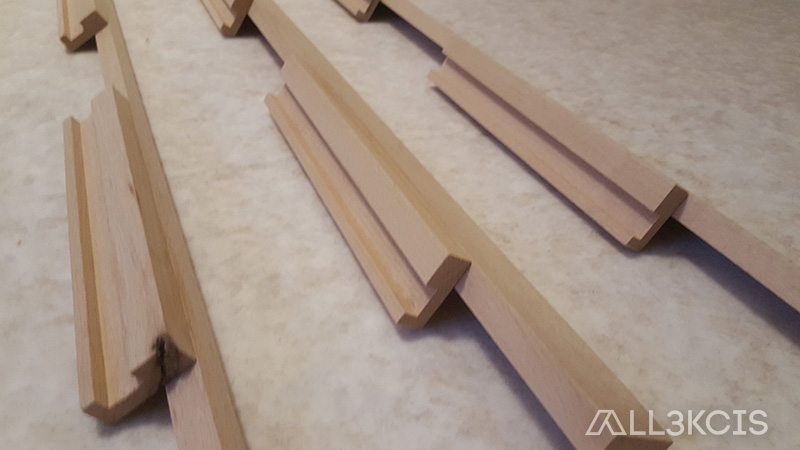

# Etagère / Mur de vinyles

  
**Auteur** : All3kcis - **Source** : [blog.alexis-mesnard.fr - Etagère / Mur de vinyles](https://blog.alexis-mesnard.fr/vinyls-wall)  
**Date** : 2019 - **Github** : [Contribute](https://github.com/all3kcis/tutorials/tree/master/vinyls-wall)

## Présentation
Décoration, mettre en avant ses vinyles

**Durée** : Rapide  
**Prix** : ~ 30€  

> Attention, prévoir une inclinaison ou revoir le système de support du vinyle pour plus d'inclinaison. Les vinyles ont tendances à tomber en avant sinon.  
> Le tasseau horizontal du bas en 13mm peut être remplacé par un tasseau de 33mm pour une meilleure rigidité

## Le matériel

- [Tasseau de hêtre 3x 33mmx2400mm](https://www.leroymerlin.fr/v3/p/produits/tasseau-hetre-sans-noeud-rabote-13-x-33-mm-l-2-4-m-e62058)
- [Tasseau de hêtre 2x 13mmx2400mm](https://www.leroymerlin.fr/v3/p/produits/tasseau-hetre-sans-noeud-rabote-13-x-13-mm-l-2-4-m-e62065)
- [Tourillon hêtre 6mm](https://www.leroymerlin.fr/v3/p/produits/tourillon-hetre-cannele-sans-noeud-6-x-6-mm-l-1-m-e133317)
- Colle à bois
  
## Ressources
  
  - [plan.eps](ressources/plan.eps)

## Photos  

  
  
  
  
  
  
  