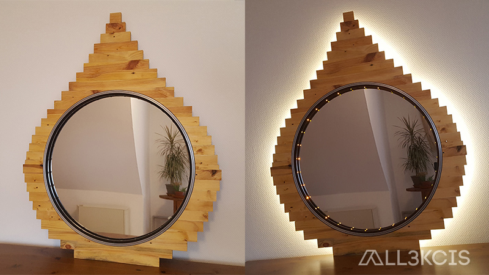
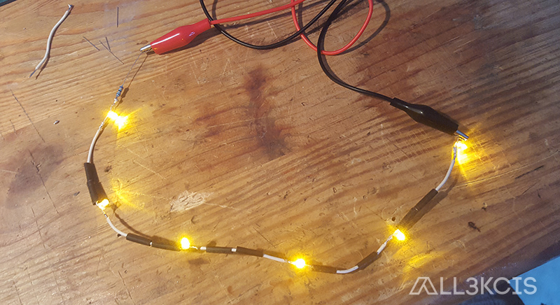
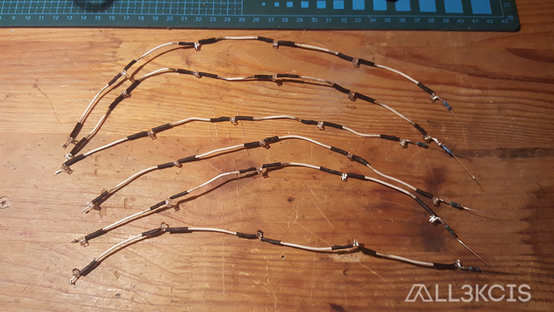
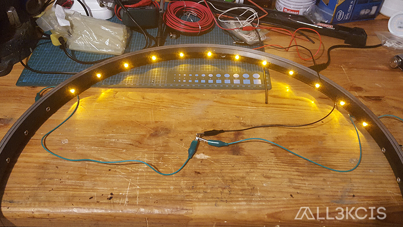
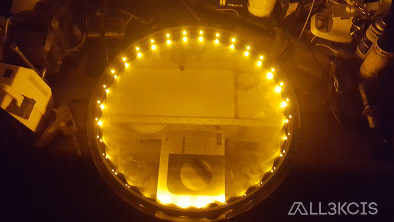
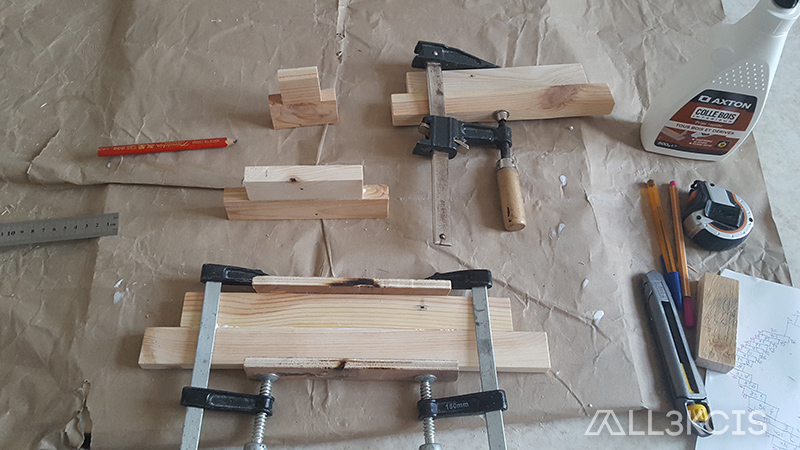
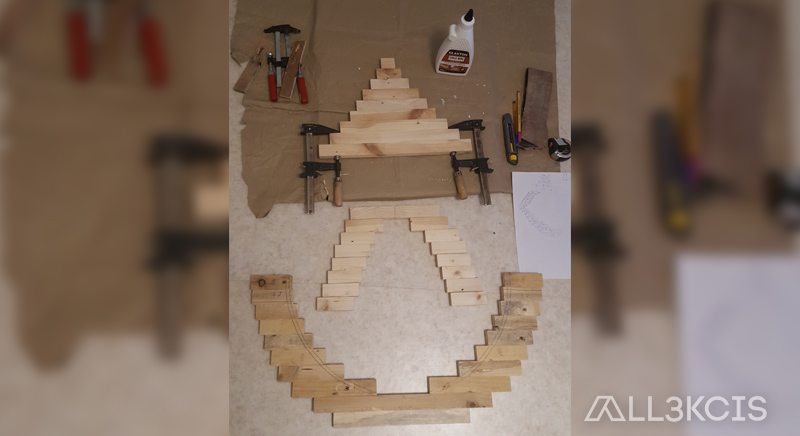
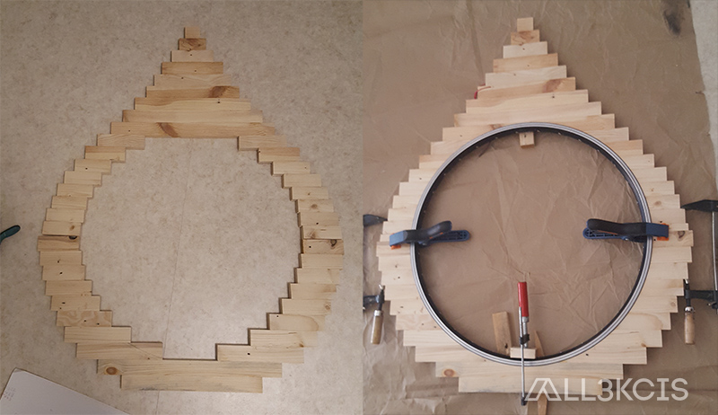
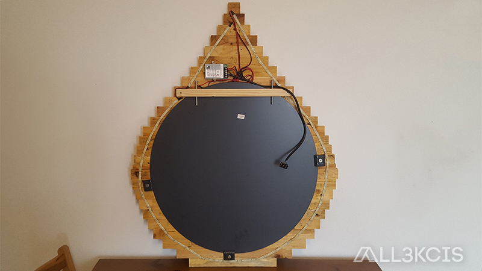

# Water droplet mirror

  
**Author** : All3kcis - **Source** : [blog.alexis-mesnard.fr - Water droplet mirror](https://blog.alexis-mesnard.fr/water-droplet-mirror)  
**Year** : 2019 - **Github** : [Contribute](https://github.com/all3kcis/tutorials/tree/master/water-droplet-mirror)

## Introduction
Mirror in the shape of a drop of water with pallet and LED lighting

**Difficulty** : Low-Medium  
**Price** : ~ 25€  

## Material

- [Round mirror 60cm](https://www.leroymerlin.fr/v3/p/produits/miroir-non-lumineux-decoupe-rond-l-60-x-l-60-cm-poli-e13161)
- [Power supply 12v](https://fr.aliexpress.com/item/32703143354.html)
- An old bike wheel
- Pallets wood
- LED and necessary for soldering (soldering station, wire, LED strip)
- Linseed oil (wood protection)
  
## Ressources
  
  - [water-droplet-mirror.jpg](ressources/water-droplet-mirror.jpg)
  - [water-droplet-mirror-model.skp](ressources/water-droplet-mirror-model.skp)

## Pictures  

  
  
  
  
  
  
  
  
  