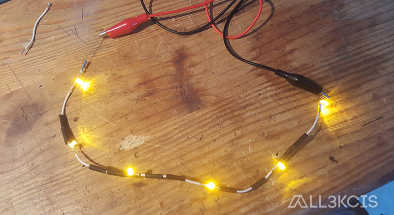
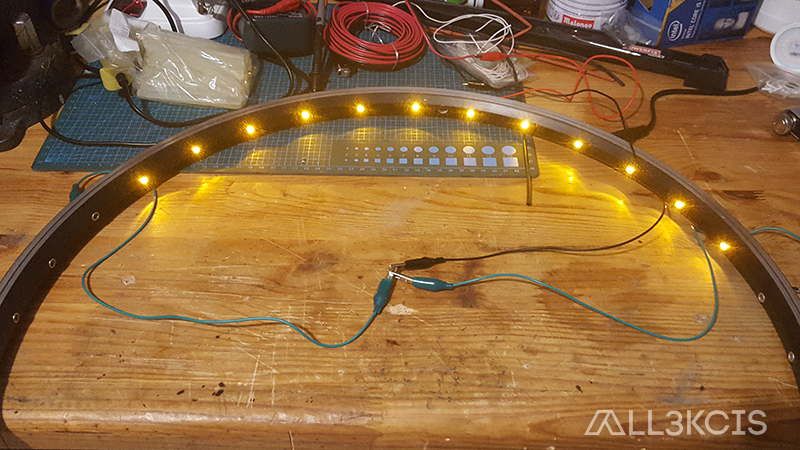
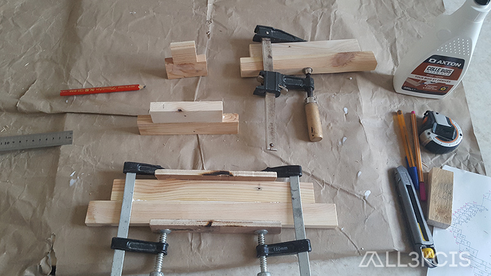
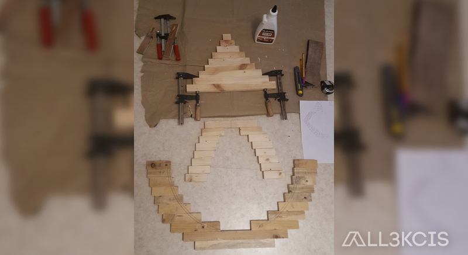
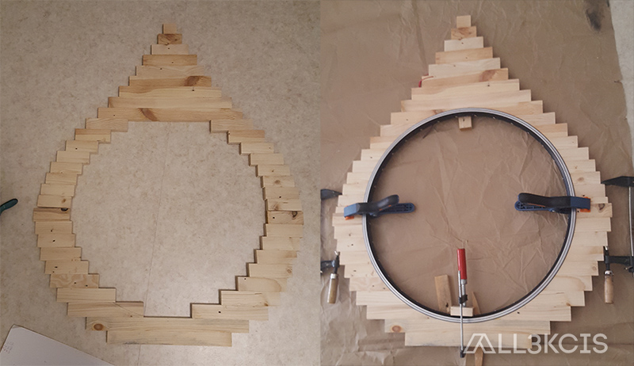

# Miroir goutte d'eau en palettes

  
**Auteur** : All3kcis - **Source** : [blog.alexis-mesnard.fr - Miroir goutte d'eau en palettes](https://blog.alexis-mesnard.fr/miroir-goutte-eau)  
**Année** : 2019 - **Github** : [Contribuer](https://github.com/all3kcis/tutorials/tree/master/water-droplet-mirror)

## Présentation
Miroir en forme de goutte d'eau avec du bois de palettes et éclairage LED

**Difficulté** : Faible-Moyen  
**Prix** : ~ 25€  

## Le matériel

- [Miroir rond 60cm](https://www.leroymerlin.fr/v3/p/produits/miroir-non-lumineux-decoupe-rond-l-60-x-l-60-cm-poli-e13161)
- [Alimentation 12v](https://fr.aliexpress.com/item/32703143354.html)
- Une vieille roue de vélo
- Du bois de palettes
- LED et nécessaire pour souder (fer à souder, cables, ruban led)
- Huile de lin (protection du bois)
  
## Ressources
  
  - [water-droplet-mirror.jpg](ressources/water-droplet-mirror.jpg)
  - [water-droplet-mirror-model.skp](ressources/water-droplet-mirror-model.skp)

## Photos  

  
  
  
  
  
  
  
  
  